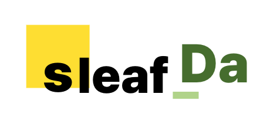

# Hello, I'm a Full-Stack Developer

A Full-Stack Developer specializing in backend engineering. I focus on building reliable server-side architectures and have a strong track record of rapidly executing short-term projects. Currently collaborating as a Backend Developer at **sleaf_da**.

* Contact: gominhwi@gmail.com

## Tech Stack

### Backend & Database

  
  
  
  
  
  
  
  
  

### Frontend & Web

  
  
  
  

### Systems & Mobile

  
  
  
  
  
  

## Github Stats

  
  

